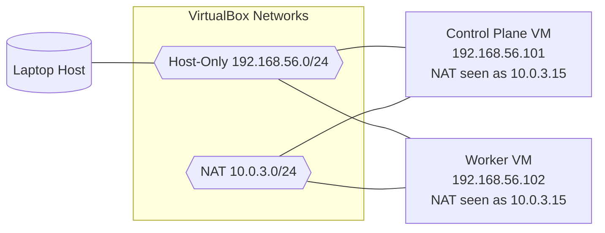
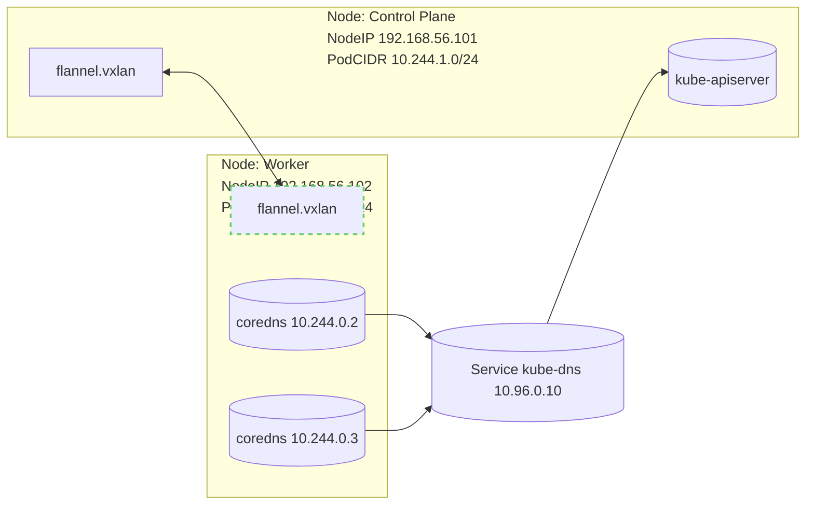

#### Friday, November 28, 2025

---

A kid-friendly story and a step‑by‑step runbook to diagnose and fix a broken cluster where CoreDNS and flannel show red.

---

## TL;DR

- Symptoms: CoreDNS stuck in ContainerCreating; flannel CrashLooping on worker; cluster events show CNI errors around `flannel` and `/run/flannel/subnet.env`.

- Root cause: Both nodes advertised the same `InternalIP` (`10.0.3.15`), confusing the CNI overlay.

- Fix: Tell kubelet to use the host‑only network (`192.168.56.0/24`) and explicitly exclude `10.0.3.15` via Talos machine configs. Apply with `talosctl`.

- Result: Flannel rolled out successfully; CoreDNS became healthy; networking recovered.

---

## The 13-Year-Old Analogy

- Imagine two houses accidentally have the exact same street address. The mail carrier (your network) doesn’t know where to deliver packages.

- Flannel is the system of roads and road signs between the houses (nodes). When addresses collide, road signs break and drivers get lost.

- CoreDNS is the town’s phonebook. If the roads are broken, you can’t reach the phonebook building to look up phone numbers like `kubernetes.default`.

- The fix was simple: give each house a unique address on the right street, then re-hang the road signs. Instantly, mail and phone lookups work again.

---

## Environment

- Distro: Talos Linux `v1.6.2`

- Kubernetes: `v1.29.0`

- CNI: flannel `ghcr.io/siderolabs/flannel:v0.23.0`

- Platform: VirtualBox‑style lab with a NAT NIC and a host‑only NIC

---

## What Was Broken

- CoreDNS pods were Pending/ContainerCreating with errors like:

- `failed to find plugin "flannel" in path [/opt/cni/bin]`

- `loadFlannelSubnetEnv failed: open /run/flannel/subnet.env: no such file or directory`

- `kube-flannel` DaemonSet: control‑plane pod Running, worker pod CrashLoopBackOff

- Both nodes reported the same `InternalIP`: `10.0.3.15`

## Lab Topology (Your Setup)

Two local VMs on a laptop:

- Control plane VM: `talos-jk6-lje`

- Worker VM: `talos-m9z-pjn`

- Each VM has two NICs: one NAT and one Host‑Only

### Network Plan

- Host‑Only network (`vboxnet0`): `192.168.56.0/24`

  - Control plane: `192.168.56.101`

  - Worker: `192.168.56.102`

- NAT network: both VMs surfaced the same internal address `10.0.3.15` to kubelet

- Pod CIDRs (flannel):

  - Control plane: `10.244.1.0/24`

  - Worker: `10.244.0.0/24`

### Diagram: Physical/VM NICs



### Diagram: Overlay (Before vs After)

```mermaid

sequenceDiagram

  autonumber

  participant CP as Control Plane (10.0.3.15 / 192.168.56.101)

  participant WK as Worker (10.0.3.15 / 192.168.56.102)

  Note over CP,WK: BEFORE – both nodes advertise 10.0.3.15

  WK->>Flannel: start

  Flannel-->>WK: cannot stabilize (duplicate node IP)

  WK->>Kubelet: Pod sandbox create

  Kubelet-->>WK: fail (CNI flannel not ready)

  Note over CP,WK: AFTER – nodes advertise 192.168.56.x via validSubnets

  WK->>Flannel: start

  Flannel-->>WK: VXLAN ready; /run/flannel/subnet.env present

  WK->>Kubelet: Pod sandbox create

  Kubelet-->>WK: success; CoreDNS runs

```

### Diagram: Kubernetes View (Pods, Service, Overlay)



### IP Summary

| Component            | Address/Range         | Notes                                   |

|----------------------|-----------------------|-----------------------------------------|

| Control Plane NodeIP | 192.168.56.101        | Host‑Only adapter (preferred by kubelet) |

| Worker NodeIP        | 192.168.56.102        | Host‑Only adapter (preferred by kubelet) |

| NAT (both VMs)       | 10.0.3.15             | Undesired for cluster traffic            |

| Service CIDR         | 10.96.0.0/12 (typical)| kube-dns at 10.96.0.10                  |

| PodCIDR (CP)         | 10.244.1.0/24         | flannel allocation                       |

| PodCIDR (Worker)     | 10.244.0.0/24         | flannel allocation                       |

### Why NAT + Host‑Only is Tricky Here

- In many lab setups, the NAT adapter presents an identical outward address from the guest’s perspective (here, `10.0.3.15`).

- Kubernetes picks a node IP from available interfaces. If it picks the NAT address on both nodes, flannel sees duplicate node IPs and fails.

- You can either remove the NAT adapter for cluster traffic, or keep it only for outbound internet and explicitly tell kubelet to use the Host‑Only network.

Recommended for labs:

- Keep Host‑Only for all cluster traffic (stable, unique IPs).

- Keep NAT only for VM outbound internet, but prevent Kubernetes from using it by pinning node IP selection (done below).

## Diagnosis

PowerShell commands (Windows host):

```powershell

# Point kubectl to the cluster

$kc = "c:\Users\Pushpendra\Desktop\projects\talos_linux_learning\kubeconfig"


# Check API and nodes

kubectl --kubeconfig $kc cluster-info

kubectl --kubeconfig $kc get nodes -o wide


# See what’s failing

kubectl --kubeconfig $kc get pods -A -o wide

kubectl --kubeconfig $kc -n kube-system get ds -o wide


# Inspect the problem pods

kubectl --kubeconfig $kc -n kube-system describe pod <flannel-pod-name>

kubectl --kubeconfig $kc -n kube-system describe pods -l k8s-app=kube-dns

kubectl --kubeconfig $kc get events -A --sort-by=.lastTimestamp


# Confirm duplicate node IPs

kubectl --kubeconfig $kc get nodes -o jsonpath="{range .items[*]}{.metadata.name}: {.status.addresses[*].type}:{.status.addresses[*].address}{'\n'}{end}"

```

Expected telltales:

- Duplicate `InternalIP` on two nodes

- kubelet events referencing flannel plugin install and missing `/run/flannel/subnet.env`

---

## The Fix (Talos Config)

Force kubelet to choose the host‑only network (`192.168.56.0/24`) and avoid the NAT IP (`10.0.3.15`). Edit both `'_out/controlplane.yaml'` and `'_out/worker.yaml'`:

```yaml

machine:

  kubelet:

    nodeIP:

      validSubnets:

        - 192.168.56.0/24

        - '!10.0.3.15/32'

```

Apply configs using `talosctl` and optionally reboot the nodes so kubelet picks the new IPs quickly:

```powershell

# Point talosctl to your cluster

$env:TALOSCONFIG = "c:\Users\Pushpendra\Desktop\projects\talos_linux_learning\_out\talosconfig"


# Verify both nodes are reachable

talosctl --talosconfig $env:TALOSCONFIG -n 192.168.56.101 version

talosctl --talosconfig $env:TALOSCONFIG -n 192.168.56.102 version


# Apply the updated machine configs

talosctl --talosconfig $env:TALOSCONFIG -n 192.168.56.101 apply-config --mode=auto -f "c:\Users\Pushpendra\Desktop\projects\talos_linux_learning\_out\controlplane.yaml"

talosctl --talosconfig $env:TALOSCONFIG -n 192.168.56.102 apply-config --mode=auto -f "c:\Users\Pushpendra\Desktop\projects\talos_linux_learning\_out\worker.yaml"


# Optional: reboot nodes

talosctl --talosconfig $env:TALOSCONFIG -n 192.168.56.101 reboot

talosctl --talosconfig $env:TALOSCONFIG -n 192.168.56.102 reboot

```

---

## Validate Recovery

```powershell

$kc = "c:\Users\Pushpendra\Desktop\projects\talos_linux_learning\kubeconfig"


# Nodes should now have unique InternalIP in 192.168.56.x

kubectl --kubeconfig $kc get nodes -o wide


# Flannel should be Ready everywhere

kubectl --kubeconfig $kc -n kube-system rollout status ds/kube-flannel --timeout=180s


# CoreDNS should converge to Ready

kubectl --kubeconfig $kc -n kube-system rollout status deploy/coredns --timeout=180s

kubectl --kubeconfig $kc -n kube-system get pods -o wide

```

### PodSecurity‑Friendly DNS Smoke Test

```powershell

@'

apiVersion: v1

kind: Pod

metadata:

  name: dns-smoke

spec:

  securityContext:

    seccompProfile:

      type: RuntimeDefault

  containers:

  - name: bb

    image: busybox:1.36

    command: ["sh","-c","sleep 3600"]

    securityContext:

      allowPrivilegeEscalation: false

      capabilities:

        drop: ["ALL"]

      runAsNonRoot: true

      runAsUser: 1000

'@ | kubectl --kubeconfig $kc apply -f -


kubectl --kubeconfig $kc wait --for=condition=Ready pod/dns-smoke --timeout=120s

kubectl --kubeconfig $kc exec dns-smoke -- nslookup kubernetes.default.svc.cluster.local

kubectl --kubeconfig $kc delete pod/dns-smoke --wait=false

```

---

## Optional Hardening

If flannel ever chooses the wrong NIC, pin the interface in the ConfigMap:

```powershell

kubectl --kubeconfig $kc -n kube-system get cm kube-flannel-cfg -o yaml > flannel-cm.yaml

# Edit net-conf.json in the ConfigMap and add: "Iface": "<your-host-only-iface>"

kubectl --kubeconfig $kc -n kube-system apply -f flannel-cm.yaml

kubectl --kubeconfig $kc -n kube-system rollout restart ds/kube-flannel

```

---

## Lessons Learned

- Unique node IPs are table stakes for CNI overlays.

- Virtualized labs often have multiple NICs; kubelet can pick the “wrong” one by default.

- `kubectl get events -A` is pure gold for CNI and sandbox errors.

- Talos makes IP selection predictable with `machine.kubelet.nodeIP.validSubnets`.

---

## Reusable Runbook

1. Check nodes: `kubectl get nodes -o wide`

2. Inspect kube‑system: `kubectl get pods -A -o wide` and `kubectl -n kube-system get ds`

3. Read events: `kubectl get events -A --sort-by=.lastTimestamp`

4. Fix node IP selection in Talos (`validSubnets` + exclusions)

5. `talosctl apply-config` (+ reboot if needed)

6. Validate flannel rollout and CoreDNS readiness

7. DNS smoke test from a secure pod

---

## Shareable Summary

Two Kubernetes nodes were fighting over the same IP (`10.0.3.15`). Flannel couldn’t build the overlay; CoreDNS couldn’t start. We told kubelet to use the host‑only network (`192.168.56.0/24`) and exclude the duplicate address. After applying with `talosctl`, flannel rolled out and CoreDNS turned green. Sometimes the fastest path to “pods Run” is just giving each node a proper address.
