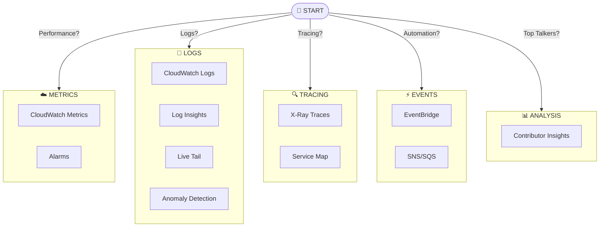

# AWS CloudWatch Exam Cheat Sheet (One-Page)

## 🧠 CloudWatch: What to Use & When (Exam View)

| Requirement / Scenario                                 | Use This CloudWatch Feature |
| :----------------------------------------------------- | :-------------------------- |
| **Monitor** CPU, memory, disk, latency                 | **Metrics**                 |
| **Alert** when threshold is breached                   | **Alarms**                  |
| **Collect logs** from EC2, Lambda, ECS                 | **Logs**                    |
| **Real-time** log debugging                            | **Live Tail**               |
| **Query** logs with SQL-like syntax                    | **Log Insights**            |
| **Detect unusual** log behavior automatically          | **Log Anomalies**           |
| **Trace** distributed microservices                    | **X-Ray Traces**            |
| **Visualize** service dependencies                     | **X-Ray Trace Map**         |
| **Event-driven** automation (scale, notify, remediate) | **Events (EventBridge)**    |
| **Identify top contributors** in high-cardinality data | **Contributor Insights**    |

## 🎯 High-Yield Exam Keywords (Memorize These)

- **Metrics** → “Performance data”, “time-series”
- **Alarms** → “Threshold”, “notify”, “trigger action”
- **Logs** → “Centralized logging”
- **Log Insights** → “Query”, “troubleshoot”
- **Live Tail** → “Real-time”
- **Log Anomalies** → “ML-based detection”
- **X-Ray** → “Latency”, “distributed tracing”
- **Trace Map** → “Service dependencies”
- **Events** → “Event-driven automation”
- **Contributor Insights** → “Top talkers”, “high cardinality”

## ❗ Common Exam Traps

> [!WARNING] Logs ≠ Metrics
> Logs contain text data; Metrics contain numerical time-series data.

> [!WARNING] Alarms don’t analyze logs directly
> Alarms monitor **Metric Filters** created from logs, or result of Log Insights queries, but not raw text.

> [!WARNING] X-Ray ≠ CloudWatch Logs
> X-Ray is for **tracing** and performance bottlenecks; Logs are for application output.

> [!WARNING] Contributor Insights ≠ Metrics math
> Use Contributor Insights for "Who is utilizing the most?"; Use Metric Math for calculations.

---

# 2️⃣ One-Page CloudWatch Decision Diagram (Exam-Oriented)

The following flow helps you choose the right tool instantly during the exam.

---

## 📋 Ready-to-post LinkedIn Caption

🚀 **Master AWS CloudWatch for your Cert Exam!**

CloudWatch is a beast 🦖, but you only need to know a few key mappings to pass.

I created a **One-Page Cheat Sheet** and a **Decision Diagram** to help you map scenarios to features instantly.

**💡 Quick Wins:**
✅ Need "Real-time" debugging? → **Live Tail**
✅ Need "Distributed Tracing"? → **X-Ray**
✅ Need "Top Talkers"? → **Contributor Insights**

## Quick Reference

| Scenario            | Service                  | Keywords                         |
| ------------------- | ------------------------ | -------------------------------- |
| Monitor CPU/RAM     | **Metrics**              | Performance, Dimension, Period   |
| Alert on threshold  | **Alarms**               | Threshold, SNS, State            |
| Debug errors        | **Logs**                 | Centralized, Error, Exception    |
| Query logs          | **Log Insights**         | SQL-like, Ad-hoc                 |
| Trace microservices | **X-Ray**                | Latency, Bottleneck, Service Map |
| Find bad actors     | **Contributor Insights** | Top Talkers, High Cardinality    |
| Automate responses  | **EventBridge**          | Rules, Lambda, Events            |

---

Swipe through to see the Decision Tree! 👉

[AWS cloudwatch file]("file:///C:/Users/Pushpendra/Documents/obsidian/blogs_html/aws_cloudwatch.html")

#AWS #CloudComputing #AWSCertification #SolutionsArchitect #DevOps #CloudWatch #Cheatsheet
