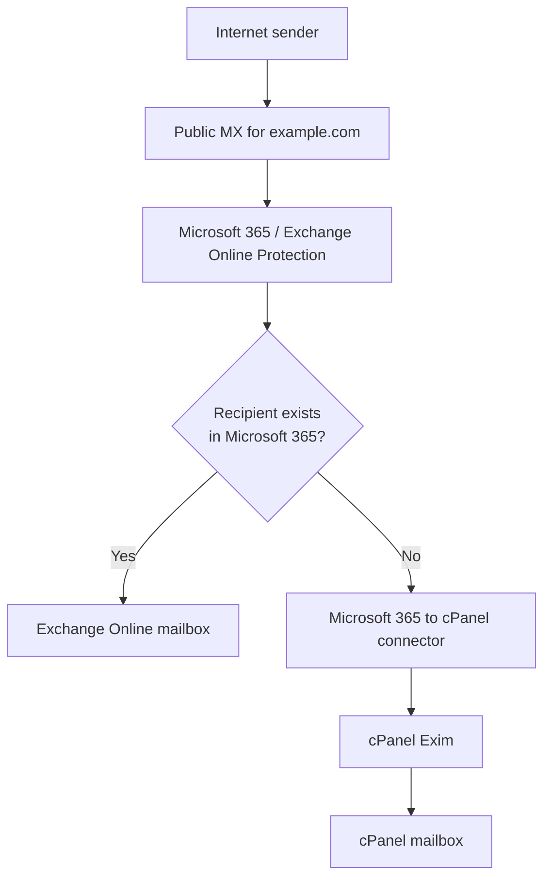
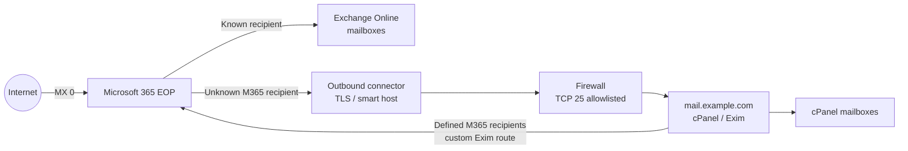
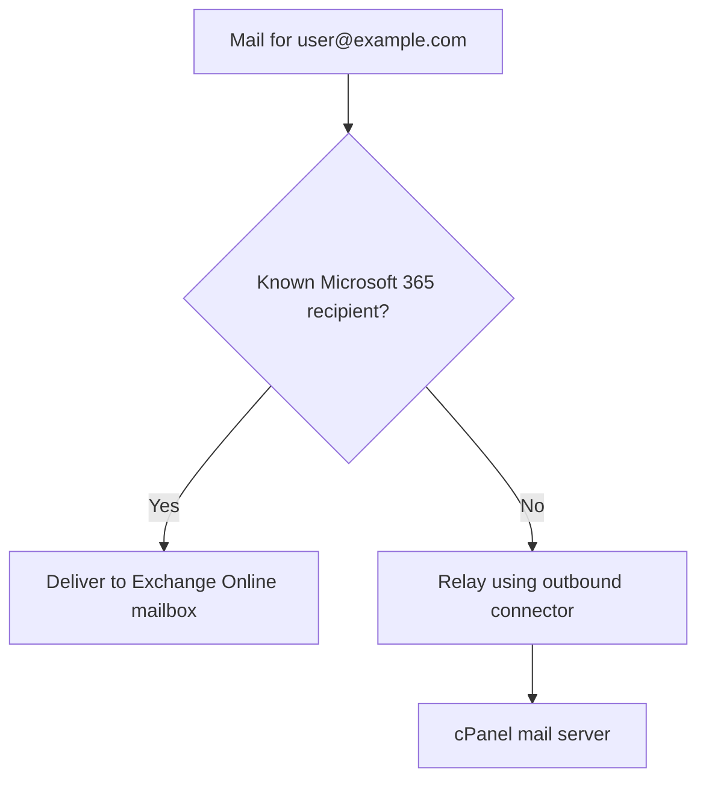
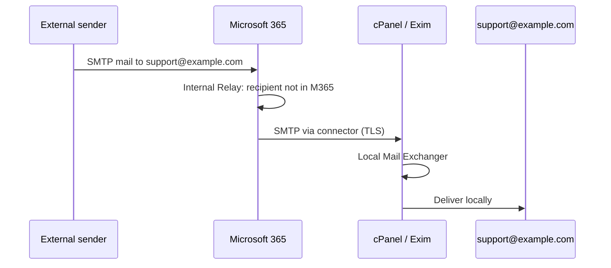
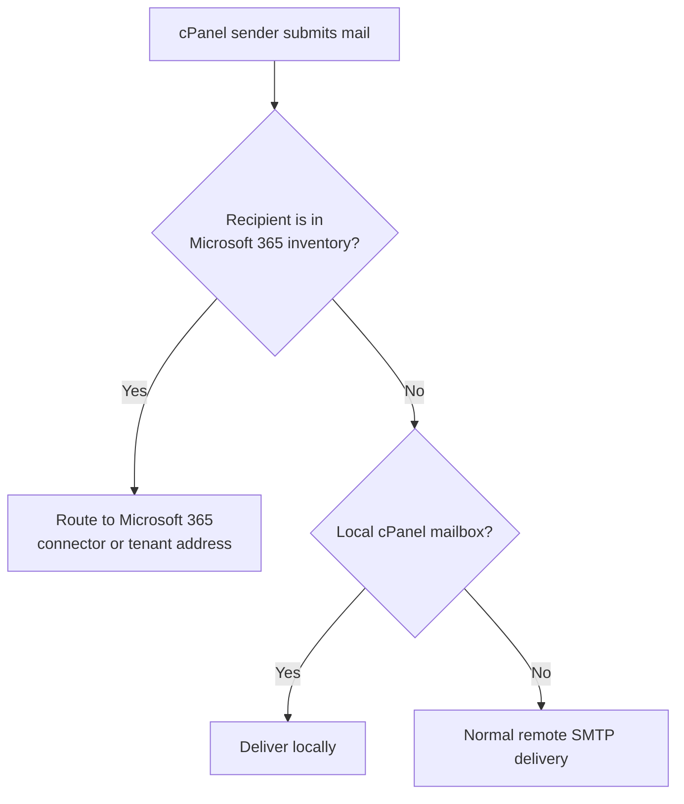
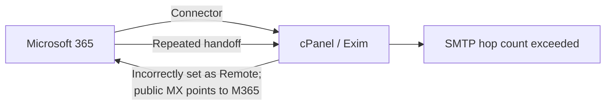

# Production Split Delivery Between Microsoft 365 Exchange Online and cPanel

> [!warning]
> cPanel does not natively support recipient-level split delivery for one domain. This is an advanced mail-routing design: document it, test every mail-flow path, and ensure a qualified mail administrator owns the custom Exim configuration.

## Purpose and scope

This guide describes a production architecture in which one SMTP domain has mailboxes on both Microsoft 365 Exchange Online and a cPanel/Exim server.

```text
Microsoft 365:  admin@example.com, finance@example.com
cPanel:         support@example.com, sales@example.com
```

It covers the recommended Microsoft 365-first topology, required routing decisions, security controls, validation, and failure modes. It does **not** provide a copy-and-paste custom Exim router: that router is environment-specific and is outside cPanel's standard supported Email Routing interface.

## The key distinction: MX routing vs. split delivery

DNS MX records route mail for a **domain**, not for individual recipients.

```text
MX can express:    example.com → Microsoft 365

MX cannot express: admin@example.com   → Microsoft 365
                   support@example.com → cPanel
```

Split delivery adds recipient-level routing after the receiving platform gets the message. In this guide, Microsoft 365 is the public mail gateway and decides whether a recipient is delivered locally or relayed to cPanel.



## Why Remote Mail Exchanger does not solve split delivery

In cPanel, **Email Routing → Remote Mail Exchanger** means that cPanel does not host mail for that domain. It will not accept local mail and sends all mail for the domain toward the lowest-numbered MX destination.

```text
MX → Microsoft 365
cPanel Email Routing → Remote Mail Exchanger
```

This is correct for a simple deployment where the website is on cPanel and **all** domain mailboxes are in Microsoft 365. It is not correct when any `@example.com` mailbox remains on cPanel. Exim does not make a per-mailbox exception merely because a cPanel mailbox exists.

> [!important]
> Remote Mail Exchanger means **“this entire domain's mail is hosted elsewhere.”** Split delivery means **“some recipients are here and some are elsewhere.”** These are different designs.

### How cPanel detects routing automatically

When **Automatically Detect Configuration** is selected, cPanel evaluates the MX record in the server's **local DNS zone file**. It does not perform a live public-DNS lookup, and the setting does not automatically change after DNS is updated.

For production environments where DNS is hosted externally, for example in Cloudflare or a registrar DNS service, set and maintain cPanel's Email Routing mode deliberately. Do not assume that changing public DNS will update the cPanel routing state.

## Target production architecture

Microsoft 365 receives all internet mail first. Exchange Online is configured to accept the domain as **Internal Relay**. It delivers mail to Microsoft 365 recipients and sends recipients not known to Microsoft 365 to cPanel through a protected connector.



### Required configuration state

| Layer | Required state | Why |
| --- | --- | --- |
| Public DNS | `MX 0` points to the Microsoft 365 Protection hostname | Makes Microsoft 365 the public inbound gateway. |
| Exchange Online accepted domain | **Internal Relay** | Delivers known Microsoft 365 users locally and relays other recipients to cPanel. |
| Exchange Online connector | Microsoft 365 → organisation's email server | Sends cPanel-hosted recipients to the cPanel SMTP endpoint. |
| cPanel Email Routing | **Local Mail Exchanger** | Lets Exim accept and deliver the cPanel-hosted mailboxes locally. |
| cPanel/Exim | Explicit route for Microsoft 365 recipients | Prevents local resolution of Microsoft 365 recipients. |
| Firewall and TLS | TCP 25 reachable from Microsoft 365; valid TLS certificate | Allows secure, reliable connector delivery. |

## Exchange Online configuration

### 1. Verify the domain

Add and verify `example.com` in Microsoft 365. The primary MX record will normally be the Microsoft 365 hostname supplied during domain setup:

```dns
example.com.  MX 0 example-com.mail.protection.outlook.com.
```

Use the exact hostname provided by the Microsoft 365 tenant, rather than copying the example above.

### 2. Set the accepted domain to Internal Relay

In the Exchange admin center, open **Mail flow → Accepted domains**, select the domain, and set its type to **Internal Relay**.

This tells Exchange Online:



An **Authoritative** accepted domain rejects unknown recipients. It is therefore inappropriate unless every cPanel recipient is also represented in Microsoft 365 as a mail-enabled object with intentional routing rules. Internal Relay is the cleaner starting point for a shared-recipient design.

### 3. Create the Microsoft 365-to-cPanel connector

In **Mail flow → Connectors**, create a connector with the following conceptual settings:

```text
Connection from: Microsoft 365
Connection to:   Your organisation's email server
Smart host:      mail.example.com
Security:        TLS enabled; certificate name validation where supported
```

The smart-host name must resolve publicly to the cPanel mail server and its TLS certificate must match the configured identity. Do not use a private address as the smart host.

Restrict the receiving firewall to Microsoft 365's published service IP ranges where operationally practical. Port 25 must be reachable from Exchange Online.

### 4. Configure the cPanel-to-Microsoft 365 trust path

For a full Microsoft 365 gateway design, configure the reciprocal connector in Exchange Online so Microsoft 365 recognises mail from the cPanel server. Microsoft documents two connectors for mail flow in both directions: one from Microsoft 365 to the organisation's server and one for mail received from that server.

The exact cPanel/Exim-side configuration depends on whether cPanel submits only Microsoft 365-bound same-domain mail or relays all outbound mail through Microsoft 365. Choose one model, document it, and avoid unintended open-relay behaviour.

## cPanel and Exim configuration

### 1. Use Local Mail Exchanger

Set the domain to:

```text
cPanel → Email Routing → Local Mail Exchanger
```

This is required because the cPanel server must accept connector-delivered mail for addresses such as `support@example.com`.



### 2. Route Microsoft 365 recipients explicitly

Local Mail Exchanger makes Exim regard the domain as local. Without extra routing, a cPanel mailbox sending to `admin@example.com` may attempt local resolution rather than deliver to Microsoft 365.

Define a controlled recipient inventory for Microsoft 365-hosted addresses and configure one of these patterns:

| Pattern | Use case | Operational consideration |
| --- | --- | --- |
| **cPanel forwarder to `user@tenant.onmicrosoft.com`** | Small, stable set of Microsoft 365 users | Straightforward but manual; manage forwarding loops and mailbox changes carefully. |
| **Custom Exim router** | Larger or frequently changing recipient set | Requires experienced Exim administration, configuration management, and regression testing after cPanel updates. |
| **Microsoft 365 smart-host route** | Microsoft 365 is the required outbound security gateway | Requires secure cPanel-to-Microsoft 365 connector and sender authentication design. |

The routing decision must run **before** normal local delivery for the defined Microsoft 365 recipients:



> [!warning]
> Do not edit generated Exim configuration files directly. Use cPanel-supported custom Exim configuration mechanisms where applicable, keep the customisation under version control, and test it after cPanel upgrades.

## Mail-flow matrix

Use this matrix as the acceptance-test plan.

| ID | Sender | Recipient | Expected route | Expected result |
| --- | --- | --- | --- | --- |
| MF-01 | External sender | Microsoft 365 mailbox | Internet → Microsoft 365 | Exchange Online delivery |
| MF-02 | External sender | cPanel mailbox | Internet → Microsoft 365 → connector → cPanel | Local cPanel delivery |
| MF-03 | Microsoft 365 mailbox | cPanel mailbox | Exchange Online → connector → cPanel | Local cPanel delivery |
| MF-04 | cPanel mailbox | Microsoft 365 mailbox | Exim recipient route → Microsoft 365 | Exchange Online delivery |
| MF-05 | cPanel website/application | Microsoft 365 mailbox | Exim recipient route → Microsoft 365 | Exchange Online delivery |
| MF-06 | cPanel mailbox | External domain | Approved outbound route | External delivery with valid authentication |

## Prevent mail loops

The principal failure mode is a loop between Microsoft 365 and cPanel.



Prevent loops with these controls:

1. Use **Local Mail Exchanger** on cPanel for a domain that has cPanel mailboxes.
2. Make recipient ownership unambiguous: every address must be classified as Microsoft 365, cPanel, alias, or invalid.
3. Route only the defined Microsoft 365 recipient set from cPanel to Microsoft 365.
4. Reject invalid recipients at the appropriate authoritative system; do not relay unknown recipients indefinitely.
5. Trace test messages in Exchange Online and inspect Exim logs before production rollout.

## Security and deliverability controls

### SMTP transport

- Use TLS on the Microsoft 365-to-cPanel connector.
- Install a publicly trusted certificate on `mail.example.com` and renew it before expiry.
- Permit TCP 25 only as required. If possible, limit the cPanel server's inbound SMTP access to Microsoft 365 service IP ranges plus legitimate public mail traffic appropriate to the design.
- Do not create an unauthenticated relay based solely on a broad IP allowlist.

### SPF, DKIM, and DMARC

If both Microsoft 365 and cPanel send internet mail as `example.com`, both must be authorised and aligned.

```text
SPF:   include Microsoft 365 and authorised cPanel sending IPs
DKIM:  enable signing for each sending platform
DMARC: monitor alignment and aggregate reports before enforcing quarantine/reject
```

The exact SPF record depends on the sending model. Avoid adding mechanisms without checking DNS lookup limits and ensure only legitimate sending infrastructure is authorised.

### Monitoring

Monitor the following after deployment:

- Microsoft 365 message traces for connector delivery, TLS, and recipient-routing failures.
- Exim mainlog and rejectlog for connector traffic, local delivery, deferred queues, and loop symptoms.
- Queue depth and retry volume on the cPanel server.
- TLS certificate expiry for the cPanel smart-host hostname.
- DMARC aggregate reports and SPF/DKIM alignment failures.

Useful Exim checks on the cPanel server include:

```bash
# Follow Exim activity while testing
tail -f /var/log/exim_mainlog

# Find an individual message by its Exim message ID
exigrep MESSAGE_ID /var/log/exim_mainlog

# Inspect the current mail queue
exim -bp
```

## Production change plan

1. Create an inventory of every address and assign an owner: Microsoft 365, cPanel, alias, or invalid.
2. Provision and test the Microsoft 365 accepted domain and connector with a non-production address.
3. Confirm cPanel mailboxes, Local Mail Exchanger, public DNS, TLS, and firewall readiness.
4. Implement the cPanel-to-Microsoft 365 recipient-routing method in a maintenance window.
5. Execute all mail-flow tests in the matrix above, including application-generated mail.
6. Review Microsoft 365 message traces and Exim logs for each test before enabling production MX delivery.
7. Monitor queues, rejections, SPF/DKIM/DMARC alignment, and connector failures during the first 24–72 hours.

## Design summary

```text
Remote Mail Exchanger
    = All mail for the domain is hosted elsewhere.

Split delivery
    = Some recipients are local and some are hosted elsewhere.
```

For production split delivery, use Microsoft 365 as the public MX and inbound gateway, configure the accepted domain as **Internal Relay**, send cPanel recipients through a protected Microsoft 365 connector, set cPanel to **Local Mail Exchanger**, and implement explicit recipient-level routing from cPanel to Microsoft 365.

## Sources

- [Email Routing | cPanel & WHM Documentation](https://docs.cpanel.net/cpanel/email/email-routing/)
- [Can I split delivery of a single domain between cPanel and Exchange/Outlook365 or Google Workspace? | cPanel](https://support.cpanel.net/hc/en-us/articles/360057105074-Can-I-split-delivery-of-a-single-domain-between-cPanel-and-Exchange-Outlook365-Google-Workspace)
- [Using cPanel and Office 365 in a hybrid scenario | cPanel Community](https://support.cpanel.net/hc/en-us/community/posts/19662578199959-Using-cPanel-and-Office-365-in-a-hybrid-scenario)
- [Local mail but pass through external provider – prevent local resolve with split delivery | cPanel Community](https://support.cpanel.net/hc/en-us/community/posts/19135282457367-Local-mail-but-pass-through-external-provider-prevent-local-resolve-with-split-delivery)
- [Manage accepted domains in Exchange Online | Microsoft Learn](https://learn.microsoft.com/en-us/exchange/mail-flow-best-practices/manage-accepted-domains/manage-accepted-domains)
- [Set up connectors to route mail between Microsoft 365 and your own email servers | Microsoft Learn](https://learn.microsoft.com/en-us/exchange/mail-flow-best-practices/use-connectors-to-configure-mail-flow/set-up-connectors-to-route-mail)
